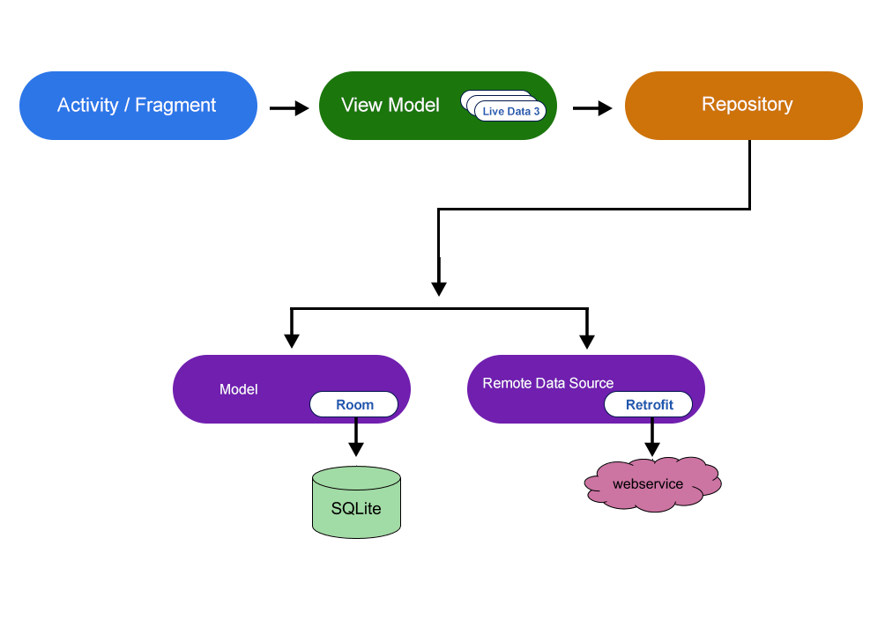

# Todo Mobile Application
	Todo application is made to remember specific task for specific date.
	
# Features!
Sign Up          |  Log In                     | Adding Task              |  Updating Task 
:----------------------------:|:--------------------------------------:|:----------------------:|:-----------------
  |          |    | 
#
SpeechToText          |  Marking Complete/Incomplete                    | Search Features               |  Swipe Right To Add to Task Completed 
:----------------------------:|:--------------------------------------:|:----------------------:|:-----------------
  |           |    | 
#
Swipe Left To Delete Task          |  Undo delete                      | Delete All               |  Filter By Date 
:----------------------------:|:--------------------------------------:|:----------------------:|:-----------------
  |           |    | 
#
Filter By Category          |  Filter By Priority                       | Completed Task               |  Log Out 
:----------------------------:|:--------------------------------------:|:----------------------:|:-----------------
  |           |    | 


---

## Download!
To run Todo application clone the project https://github.com/nischal24/Todo-Application.git from github.  
	
Install
Install clone todo project and setup the in android studio	

```sh
$ git clone https://github.com/nischal24/Todo-Application.git
```
## Plugins and Dependencies

This app imported different dependencies some of them are given below:

| Dependencies | README |
| ------ | ------ |
| Material Design | implementation 'com.google.android.material:material:1.1.0' |
| Card View |implementation "androidx.cardview:cardview:1.0.0" |
| Recycler View |implementation 'androidx.recyclerview:recyclerview:1.1.0' |
| Room Database |implementation "androidx.room:room-runtime:$room_version" |
| Room Compiler |annotationProcessor "androidx.room:room-compiler:$room_version" |
| Live Data |implementation 'androidx.lifecycle:lifecycle-extensions:2.2.0' |

---
## About using the App
#### ***1 Register/ Sign Up:*** : Fill the information to signup
#### ***2 Login:*** : After signing up, login using the same credentials
##### ***3 Add Task:*** : Click on the floating icon in the bottom of the app and fill the information to add tasks
#### ***4 Update Task:***  : Once task has been created, task can be updated by clicking tasks displayed to update it
#### ***5 Deleting specific task :***  Swipe in the left direction on the task created to delete it
#### ***6 Move Tasks to Completed:***  Swipe in the right direction on the task created to remove teh completed task
#### ***7 Delete All Tasks :*** Click on the delete icon to delete all listeed tasks
#### ***8 Filter by Date:*** Click on all/today/upcoming tab in the bottom navigation view ro filter task by date 
#### ***9 Filter by Category:*** Click on spinner and select the category to filter task by category 
#### ***10 Completed task:*** on menu click completed task to view all the completed task 

---

## Documentation
#### Model–view–viewmodel(MVVM):
 This project is built in MVVM Architecture.MVVM is one of the architectural patterns which enhances separation of concerns, it allows separating the user interface logic from the business (or the back-end) logic. Its target (with other MVC patterns goal) is to achieve the following principle “Keeping UI code simple and free of app logic in order to make it easier to manage”.
 
 
 MVVM pattern helps helps to cleanly separate the business and presentation logic of an application from its user interface (UI),maintaining a clean separation between application logic and the UI helps to address numerous development issues and can make an application easier to test, maintain, and evolve. It can also greatly improve code re-use opportunities and allows developers and UI designers to more easily collaborate when developing their respective parts of an app. Some of the depency required for MVVM are:

 ```sh

    def room_version = "2.2.5"
    implementation "androidx.room:room-runtime:$room_version"
    annotationProcessor "androidx.room:room-compiler:$room_version"

    implementation 'androidx.lifecycle:lifecycle-extensions:2.2.0'
```
[CardView] Apps often need to display data in similarly styled containers. These containers are often used in lists to hold each item's information. The system provides the CardView API as an easy way for you show information inside cards that have a consistent look across the platform. These cards have a default elevation above their containing view group, so the system draws shadows below them. Cards provide an easy way to contain a group of views while providing a consistent style for the container. The dependency required for cardview is:
dependecies
```sh
     implementation "androidx.cardview:cardview:1.0.0"
```

[Material Design] is a comprehensive guide for visual, motion, and interaction design across platforms and devices. The dependency required to use material design is:
```sh
    implementation 'com.google.android.material:material:1.1.0'
```
[Recycler view] The RecyclerView widget is a more advanced and flexible version of ListView . In the RecyclerView model, several different components work together to display your data. The overall container for your user interface is a RecyclerView object that you add to your layout.The dependency required for recycler view is:
```sh
    implementation 'androidx.recyclerview:recyclerview:1.1.0'
```


 


	
